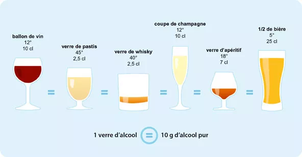

# Alcohol Consumption Estimator

## Overview
This project aims to build a web application that helps individuals estimate their **annual alcohol consumption** based on their **weekly intake**.  
The application also compares the user’s estimated consumption with the **national average** of the country they reside in.

---

## Features
- **Annual Estimation**: Enter your weekly alcohol consumption and get an automatic calculation of your yearly intake (liters per year).
- **Country Comparison**: See how your consumption compares to the average in your country.
- **Data Visualization**: Clear charts and summaries to make the results easy to understand.
- **Privacy First**: No personal data is stored; calculations are performed only for the user session.

---

## Motivation
Alcohol consumption is often measured at the population level, but individuals rarely have a clear picture of their own habits in relation to national averages. 



This tool provides:
- A simple way to **quantify personal consumption**.
- Contextual information to **compare with national statistics**.
- A foundation for **educational and awareness initiatives**.

---

## How It Works
1. **Input Weekly Consumption**  
   - Users enter their weekly alcohol intake (in equivalent units).
2. **Annual Calculation**  
   - The app multiplies weekly consumption by 52 to estimate yearly intake.
3. **Country Average Comparison**  
   - The app retrieves average consumption data for the user’s country.
   - A comparison is displayed to show whether the user is above, below, or near the national average.

---

## Content

This project is structured as follow:

```
.
├─ README.md                                  # Presentation of the project
├─ DESCRIPTION                                # Project metadata
├─ LICENSE.md                                 # License of the project
|
├─ data/                                      # Contains raw data
|  ├─ alcohol_per_country.csv                 # Reference dataset
|  ├─ smallData.csv                           # Dummy dataset
|
├─ R/                                         # Contains R functions (only)
|  ├─ 01_download_world_data.R                # Download country data  
|  ├─ 02_load_world_data.R                    # Load country data
|  ├─ 03_mean.R                               # Mean alcohol per country
|  ├─ 04_calcul_alcool.R                      # Calculate alcohol cons.
|  ├─ 05_pays_similaire.R                     # ID your most similar country
|  ├─ 06_import_spatial_countries.R           # Import spatial data
|  ├─ 07_join_countries.R                     # Join data
|  ├─ 08_diff_ton_pays.R                      # Compare to your country
|  ├─ 09_plot.R                               # Plot comparison to your country
|  └─ loop.R

├─ analyses/                                  # Contains R scripts
|  └─ mise-en-place.qmd                       # Script to create the compendium
|
├─ docs
|
├─ index.qmd
|
├─ _targets.R
└─ make.R                                     # Script to setup & run the project
```
---

## Contributing
Contributions are welcome!  
Please fork the repository, create a feature branch, and submit a pull request.  
Make sure to follow reproducibility and FAIR principles (Findable, Accessible, Interoperable, Reusable).

---

## License
This project is licensed under the XXX License.  
See the [LICENSE](LICENSE) file for details.